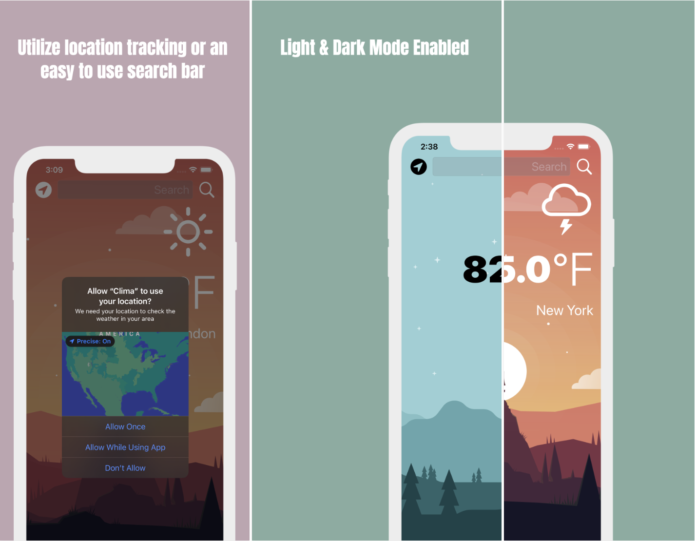

#  Clima Weather

## My Goal

For the past 6 months, I have been studing (and obsessing over) IOS development. I started the bulk of my IOS journey by following a course on Udemy, iOS & Swift - The Complete iOS App Development Bootcamp. While following that course, I created some super fun projects and was able to expand on each of them by creating my own features. Though the app was created with an instructor, I feel it helps represent the skills and tools I now possess as an IOS developer.

## What I Learned

* How to create a dark-mode enabled app.
* How to use vector images as image assets.
* Learn to use the UITextField to get user input. 
* Learn about the delegate pattern.
* Swift protocols and extensions. 
* Swift guard keyword. 
* Swift computed properties.
* Swift closures and completion handlers.
* Learn to use URLSession to network and make HTTP requests.
* Parse JSON with the native Encodable and Decodable protocols. 
* Learn to use Grand Central Dispatch to fetch the main thread.
* Learn to use Core Location to get the current location from the phone GPS. 

>This is a companion project to The App Brewery's Complete App Development Bootcamp [www.appbrewery.co](https://www.appbrewery.co/)

